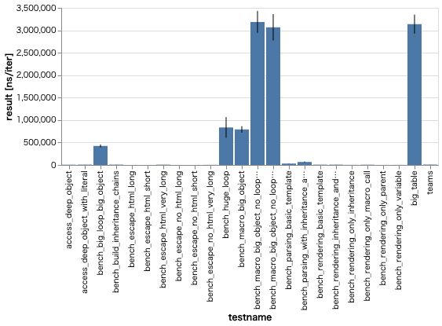

# cargobench-plot

`cargo bench` result plotting tool.

*This crate is highly under development.*

use [Vega-Lite V3 for Rust](https://crates.io/crates/vega_lite_3).



## Installation

```
$ cargo install --git https://github.com/hhatto/cargobench-plot.git
```

## Usage

```
$ cargo +nightly bench | cargobench-plot
```

## License
Apache-2.0
